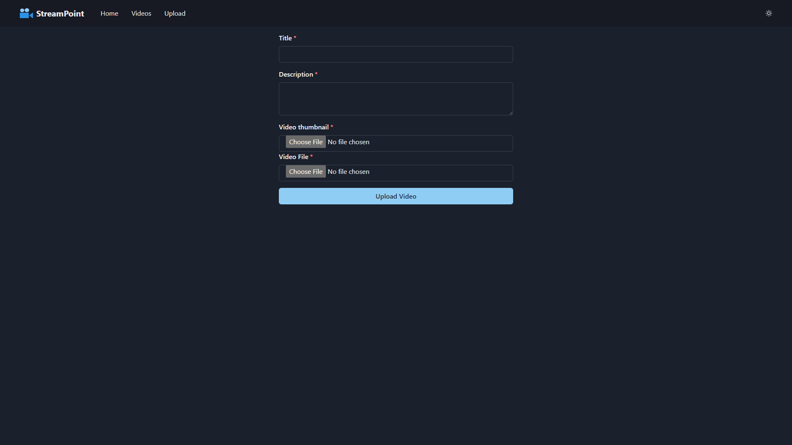
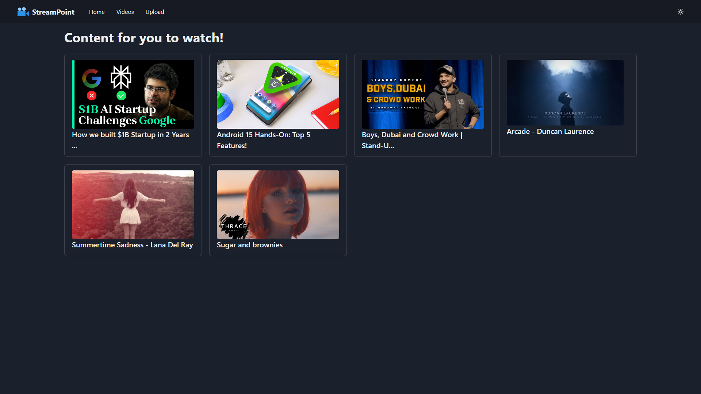
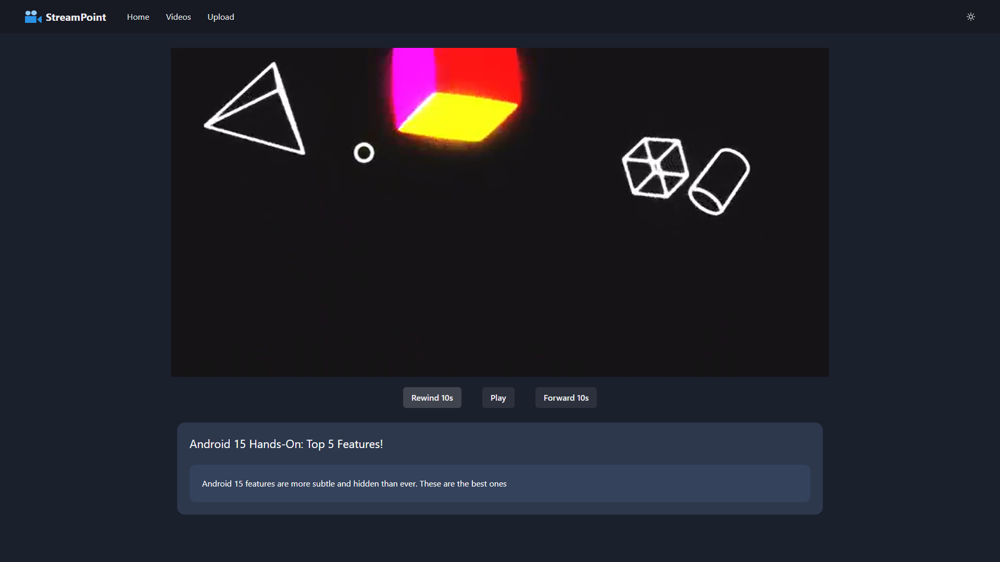
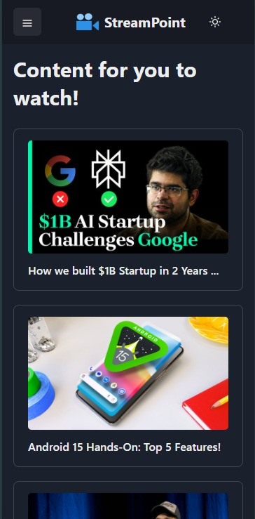

# Video Streaming Platform

A video streaming platform with a Spring Boot backend and a React frontend. Users can upload videos along with thumbnails, and stream videos directly from the platform. With a responsive and easy to use interface with great video streaming quality and efficiency, StreamPoint could be a very handy web app for uploading and streaming videos.

The main aim of this project is to allow seamless video sharing between users with a user friendly and interactive UI. The interface is easy to use and provides seamless video streaming functionality to the user.

This project is also AWS Elastic Beanstalk and AWS RDS ready.

## This project uses ->
- React (Front end)
- Spring Boot (Backend)
- Zustand (For react state management)
- Amazon AWS S3 Bucket (For video and thumbnail storage)
- MySQL Database (For storing video metadata and AWS urls)
- Chakra UI

## Features

- Upload videos with thumbnails
- Stream videos with HTTP range support
- Display uploaded thumbnails

## Technologies Used

- Spring Boot (Backend)
- React with Chakra UI (Frontend)
- AWS S3 for storage (optional)

## Getting Started

### Prerequisites

- Java 17+
- Node.js & npm
- Maven
- AWS S3 bucket

### Setup

1. **Clone the repository:**

    ```bash
    git clone https://github.com/AnantSingh1510/StreamPoint.git
    cd video-streaming-platform
    ```

2. **Backend Setup:**

    - Navigate to the backend directory:
      ```bash
      cd backend
      ```
    - Update `application.properties` with your appropriate credentials:
      ```properties
      spring.datasource.url=jdbc:mysql://localhost:3306/videostreaming //Database instance address
      spring.datasource.username=root //MySQL database username
      spring.datasource.password=root //MySQL database password
      spring.jpa.hibernate.ddl-auto=update 
      spring.jpa.show-sql=true

      spring.config.import=optional:classpath:application-aws.properties //Imports the aws-application configuration file

      spring.servlet.multipart.max-file-size=50MB //Maximum size for the uploaded video
      spring.servlet.multipart.max-request-size=50MB //Maximum size for the upload video request
      ```
    - Update `aws-application.properties` with your AWS S3 credentials:
      ```properties
      aws.accessKeyId=YOUR_AWS_ACCESS_KEY
      aws.secretKey=YOUR_AWS_SECRET_KEY
      aws.s3.bucket=YOUR_S3_BUCKET_NAME
      ```
    - Build and run the backend:
      ```bash
      mvn clean install
      mvn spring-boot:run
      ```

3. **Frontend Setup:**

    - Navigate to the frontend directory:
      ```bash
      cd frontend
      ```
    - Install dependencies:
      ```bash
      npm install
      ```
    - Start the frontend:
      ```bash
      npm run start
      ```

### Usage

- Open your browser and navigate to `http://localhost:3000`.
- Upload a video with a title, description and thumbnail.
- Stream the uploaded video.

### Screenshots

#### Upload Video


#### Video List


#### Video Playback


#### Video Playback


## License

This project is licensed under the MIT License.
